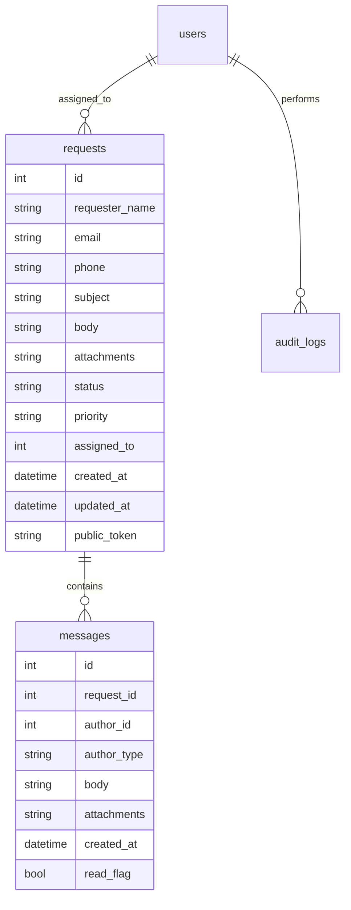

```mermaid
erDiagram
  requests ||--o{ messages : contains
  users ||--o{ requests : assigned_to
  users ||--o{ audit_logs : performs
  requests {
    int id
    string requester_name
    string email
    string phone
    string subject
    string body
    string attachments
    string status
    string priority
    int assigned_to
    datetime created_at
    datetime updated_at
    string public_token
  }
  messages {
    int id
    int request_id
    int author_id
    string author_type
    string body
    string attachments
    datetime created_at
    bool read_flag
  }
```
