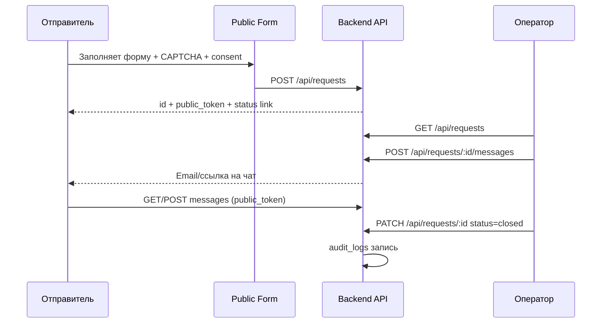

```mermaid
sequenceDiagram
  participant User as Отправитель
  participant Site as Public Form
  participant API as Backend API
  participant Staff as Оператор
  User->>Site: Заполняет форму + CAPTCHA + consent
  Site->>API: POST /api/requests
  API-->>User: id + public_token + status link
  Staff->>API: GET /api/requests
  Staff->>API: POST /api/requests/:id/messages
  API-->>User: Email/ссылка на чат
  User->>API: GET/POST messages (public_token)
  Staff->>API: PATCH /api/requests/:id status=closed
  API->>API: audit_logs запись
```
